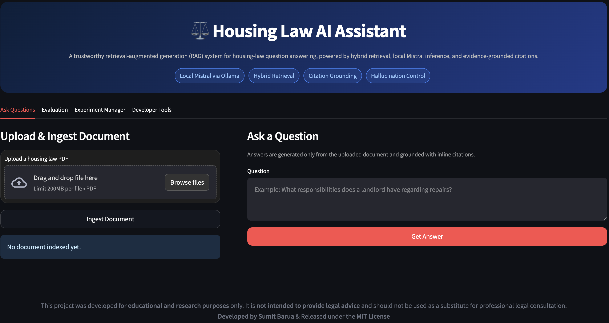
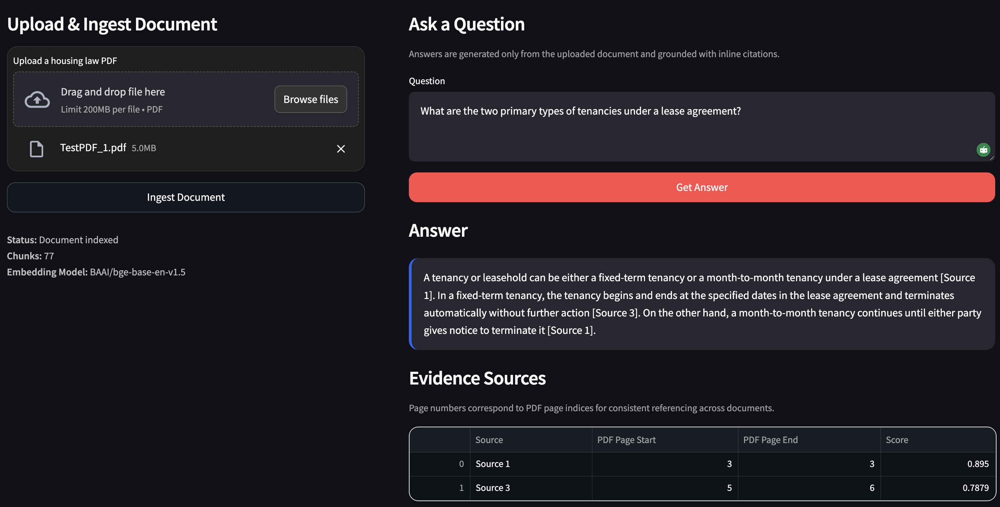
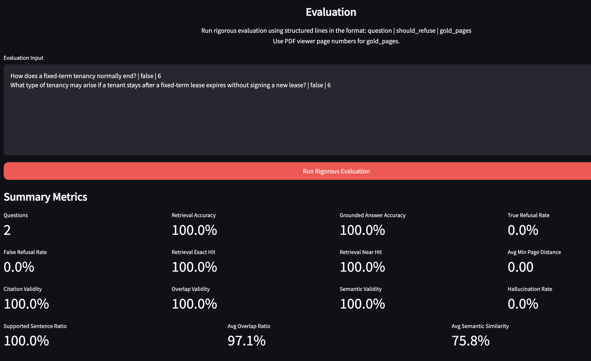

# Trustworthy RAG System for Housing Law Question Answering
### Local LLM + Evidence Grounding + Hallucination Control

[][Python-url]
[][Streamlit-url]
[][Ollama-url]
[][Mistral-url]
[][RAG-url]


A **Retrieval-Augmented Generation (RAG)** system for **housing-law question answering** that answers user queries using a legal document while reducing hallucinations through:

- **semantic retrieval**
- **evidence grounding**
- **retrieval score thresholding**
- **deduplication**
- **heuristic reranking**
- **context pruning**
- **inline source citations**

The system ingests a housing-law PDF, retrieves the most relevant legal passage, and generates a **citation-grounded answer** using a **locally hosted Mistral LLM via Ollama**.

> **Goal:** Build a trustworthy legal QA system where answers come from the document, not from unsupported model knowledge.

---

<!-- ## Demo Preview

> Add your screenshots after pushing the repo. Suggested filenames are shown below.

### Main UI


### Answer + Evidence View


### Evaluation / Debug View


--- -->

## Why This Project Matters

Large language models can produce **plausible but unsupported answers**, which is especially risky in **legal question answering**. This project demonstrates how a **trustworthy RAG pipeline** can reduce hallucination and improve reliability by enforcing:

- document-only answering
- citation grounding
- refusal when evidence is insufficient
- transparent retrieval debugging

This project is intentionally designed as a **systems-oriented applied AI prototype**, not just a wrapper around an LLM API.

---

## Key Features

### Document-Grounded QA
Answers are generated **only from retrieved legal text**.

### Local LLM Inference
Runs **Mistral locally via Ollama**, with no dependency on external LLM APIs.

### Hallucination Mitigation
The system refuses out-of-scope queries using a **minimum similarity threshold**.

### Semantic Retrieval
Uses **sentence-transformer embeddings** instead of lexical TF-IDF retrieval.

### Retrieval Optimization
The final retrieval stack includes:

- paragraph-aware chunking
- low-information chunk filtering
- semantic similarity search
- retrieval deduplication
- heuristic reranking
- top-chunk context pruning

### Explainability
The UI exposes:

- retrieved chunks
- similarity scores
- evidence pages
- retrieval flow debugging

### Evaluation Pipeline
A built-in evaluation flow tests:

- in-scope answer behavior
- out-of-scope refusal behavior
- retrieval confidence

---

## System Architecture

```text
PDF ingestion
 ↓
paragraph-aware chunking
 ↓
semantic embeddings
 ↓
vector similarity search
 ↓
score threshold filtering
 ↓
retrieval deduplication
 ↓
heuristic reranking
 ↓
context pruning (top evidence)
 ↓
LLM generation (Mistral)
 ↓
citation-grounded answer
```


The system follows the standard **RAG pipeline**:

1. **Ingestion**
2. **Retrieval**
3. **Generation**
4. **Evaluation**

---

# Pipeline Overview

## 1. Document Ingestion

The input document is parsed and indexed as a searchable knowledge base.

Steps:

1. Extract text from PDF
2. Apply paragraph-aware chunking
3. Filter low-information chunks
4. Preserve page metadata
5. Generate semantic embeddings
6. Build retrieval index

Example ingestion output:
```brew
Total chunks created: 189
Chunks indexed: 189
```

Each chunk stores:
```brew
chunk_id
page_start
page_end
text
```


---

## 2. Retrieval

When a user asks a question:

1. The query is converted into a dense embedding vector
2. Similarity scores are computed against document chunk embeddings
3. Top-k candidates are retrieved
4. Near-duplicate chunks are removed
5. Chunks are reranked using a lightweight legal-obligation heuristic
6. Only the top evidence chunk is passed to the LLM

Example retrieval output:
```brew
Retrieved before deduplication: 3
Retrieved after deduplication: 2
Retrieved after reranking: 1
Chunks passed to LLM: 1
Top similarity score: 0.75
Retrieved pages: 36–36
```


A **minimum similarity threshold** determines whether the system should answer or refuse.

---

## 3. Generation

The retrieved evidence is sent to a **locally hosted Mistral LLM**.

The prompt enforces:

- answers grounded in retrieved evidence
- explicit citation of supporting sources
- refusal if evidence is insufficient

Example output:
```brew
Answer:
A landlord must make repairs required by law and maintain
essential systems such as heating and structural components.

[Source 1], [Source 2]
```


---

# Hallucination Prevention

The system uses several safety layers:

## Retrieval confidence threshold
If the top score is below a configured threshold, the system refuses to answer.

```brew
if top_score < min_score:
    return "Refusal: insufficient evidence retrieved."
```

## Deduplication
Removes repeated evidence chunks.

## Reranking
Promotes chunks with stronger legal-duty language such as:
- must
- required by law
- maintain
- reasonable time
- repairs

## Context pruning
Only the top-ranked evidence chunk is passed to the LLM, preventing side clauses from contaminating the answer.

## Inline citations
Citations remain directly attached to claims in the answer.

---

# Hallucination Prevention

The system avoids unsupported answers using a **retrieval confidence threshold**.


Example refusal:
```brew
Refusal: insufficient evidence retrieved.
```

This mechanism significantly reduces hallucinations in RAG systems.

---

# Experimental Evolution

The system was improved iteratively.

Initial issues
- noisy chunking
- lexical retrieval limits
- duplicate evidence
- broad answers
- irrelevant side clauses in responses

Improvements implemented
1. Paragraph-aware chunking - Replaced naive token-window chunking with more coherent legal clause grouping.

2. Semantic retrieval - Replaced TF-IDF retrieval with dense embedding-based retrieval.

3. Deduplication - Removed repeated page-36 repair passages from the final evidence set.

4. Heuristic reranking - Prioritized chunks expressing direct legal obligations.

5. Context pruning - Passed only the highest-ranked evidence chunk to the LLM.

These changes significantly improved answer focus and grounding.

---

# Evaluation

A small evaluation set was used to test system behavior.

Evaluation categories:

- in-scope legal questions
- out-of-scope queries
- refusal correctness

## Evaluation Questions
```brew
What responsibilities does a landlord have regarding repairs?
How much notice must a landlord give before eviction?
What can a tenant do if the landlord refuses to fix something?
How long does a landlord have to return a security deposit?
What rights does a tenant have regarding maintenance?
What is the federal tax rate for rental income?
What is the population of Michigan?
```

## Experimental Results

| Metric | Result |
|------|------|
| Total questions tested | 7 |
| In-scope questions | 5 |
| Correct in-scope answers | 5 / 5 (100%) |
| Out-of-scope questions | 2 |
| Correct refusals | 2 / 2 (100%) |


### Average top retrieval score
| Category | Average Score |
|------|------|
| In-scope questions | 0.69 |
| Out-of-scope questions | 0.37 |

This score separation supports the use of a confidence threshold for hallucination prevention.

---

## Final Evaluation Snapshot
| Question | Refused | Top Score | Retrieved Pages |
|----|----|----|----|
| What responsibilities does a landlord have regarding repairs? | No | 0.7504 | 36 |
| How much notice must a landlord give before eviction? | No | 0.6267 | 58 |
| What can a tenant do if the landlord refuses to fix something? | No | 0.6591 | 36 |
| How long does a landlord have to return a security deposit? | No | 0.7062 | 11 |
| What rights does a tenant have regarding maintenance? | No | 0.6940 | 29 |
| What is the federal tax rate for rental income? | Yes | 0.4490 | 60 |
| What is the population of Michigan? | Yes | 0.2882 | 5 |


---

# Tech Stack

| Component | Technology |
|---|---|
| LLM | Mistral (Ollama) |
| Embeddings | Sentence Transformers
| Language | Python |
| Frontend | Streamlit |
| PDF Parsing | PyPDF |
| Similarity / Retrieval | Semantic Vector Search
| Evaluation | Custom pipeline |

---

# Project Structure
```brew
housing-rag/
│
├── app.py
│
├── rag/
│   ├── pdf_parse.py
│   ├── chunking.py
│   ├── semantic_store.py
│   ├── retrieval_utils.py
│   ├── reranker.py
│   ├── prompts.py
│   ├── validators.py
│   └── ollama_client.py
│
├── assets/
│   └── screenshots/
│       ├── main-ui.png
│       ├── answer-evidence.png
│       └── eval-view.png
│
├── documents/
│   └── tenantlandlord.pdf
│
├── requirements.txt
└── README.md

```


---

# Running the Project

## 1. Clone the repository
```brew 
https://github.com/sum1tbarua/RAG-Based-Housing-Law-QA-System.git
cd RAG-Based-Housing-Law-QA-System

```


---

## 2. Create and activate a virtual environment
```brew
python3 -m venv .venv
source .venv/bin/activate
```

---

## 3. Install dependencies
```brew
python -m pip install --upgrade pip setuptools wheel
python -m pip install -r requirements.txt
```

---
## 4. Install Ollama
```brew
https://ollama.ai
```

## 5. Download required models
```brew
ollama pull mistral
ollama pull nomic-embed-text
```


---

## 4. Start Ollama
```brew
ollama serve
```


---

## 5. Launch the app
```brew
python -m streamlit run app.py
```


---
# Recommended Runtime Configuration
Use this as the final stable configuration:
```brew
Chunk size: 300
Chunk overlap: 60
Retrieval top_k: 3
Similarity threshold: 0.50
Deduplication: enabled
Reranking: enabled
Context chunks passed to LLM: 1
LLM: Mistral via Ollama
```

---
# Example Workflow

1. Upload housing-law document
2. Run ingestion pipeline
3. Ask legal question
4. Inspect retrieved evidence and page numbers
5. Review grounded answer with inline citations
6. Run quick evaluation queries

---

# Example Questions
```brew
What responsibilities does a landlord have regarding repairs?
How much notice must a landlord give before eviction?
How long does a landlord have to return a security deposit?
```


---

# Recommendations / Next Steps
This project is already a strong prototype, but future improvements could include:

1. Hybrid Retrieval - Embedding-based semantic retrieval
2. Cross-Encoder Reranking - Replace heuristic reranking with a learned reranker for finer passage selection.
3. Larger Evaluation Benchmark - Expand beyond 7 questions to evaluate retrieval robustness more systematically.
4. Multi-Document Support - Allow multiple housing-law documents or jurisdiction-specific legal guides.
5. Citation Verification Layer - Add stricter answer-to-evidence validation beyond inline source references.
6. Visual Results Dashboard - Add charts for answer accuracy, refusal accuracy, retrieval score distributions, question-type breakdowns


---

# Why This Project Matters

Large language models often **hallucinate facts** when answering questions.

This project demonstrates how **retrieval-augmented generation with evidence grounding** can significantly improve reliability when building domain-specific AI systems.

---

# Author

**Sumit Barua**

MS Computer Science  
Western Michigan University

# Supervisor

**Guan Yue Hong**

Associate Professor, Computer Science  
Western Michigan University


<!-- MARKDOWN LINKS & IMAGES -->
[Streamlit-url]: https://streamlit.io/
[Python-url]: https://www.python.org/
[Ollama-url]: https://ollama.com/
[Mistral-url]: https://mistral.ai/
[RAG-url]: https://aws.amazon.com/what-is/retrieval-augmented-generation/